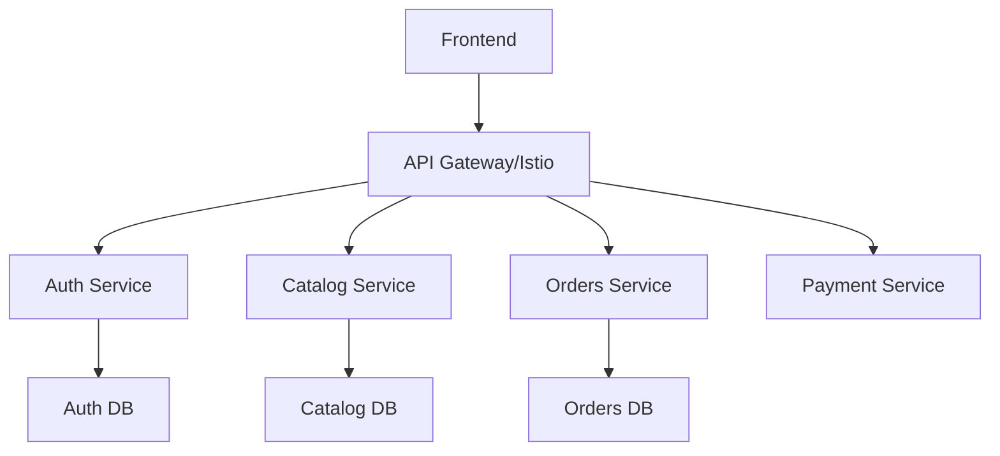
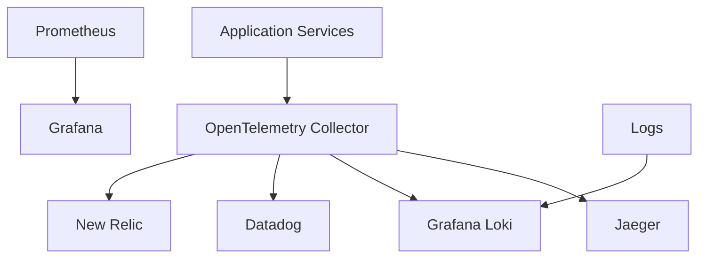
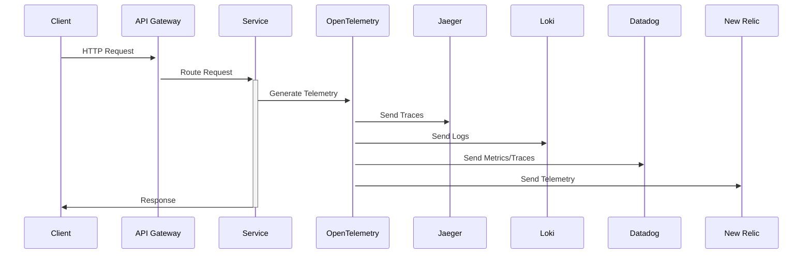
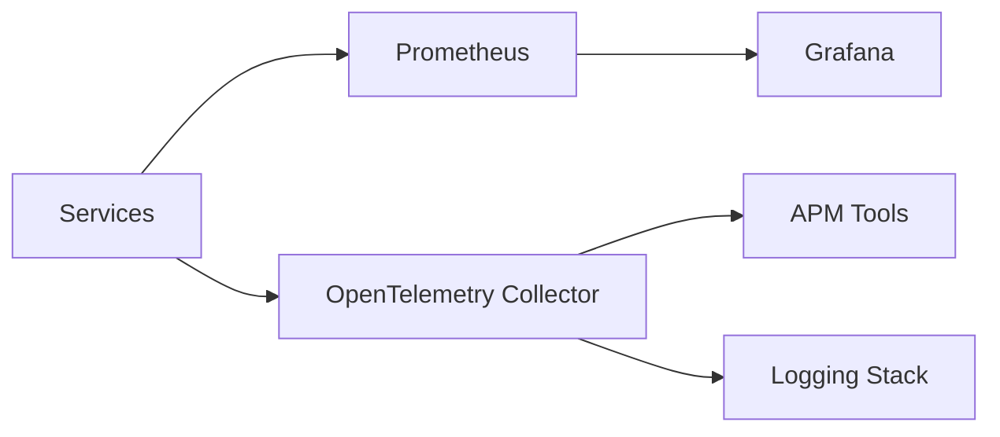

# E-commerce Platform Architecture

## System Components Overview

### Core Services

### Observability Stack

## Observability Components

### 1. Metrics Pipeline
- **Prometheus**
  - Scrapes metrics from services
  - Stores time-series data
  - Provides PromQL for querying

- **Grafana**
  - Visualizes metrics
  - Custom dashboards
  - Alerting rules

### 2. Logging Pipeline
- **Grafana Loki**
  - Log aggregation
  - Label-based logging
  - Integration with Grafana

### 3. Tracing Pipeline
- **Jaeger**
  - Distributed tracing
  - Service dependency analysis
  - Performance bottleneck detection

### 4. APM Solutions
- **Datadog**
  - Full-stack monitoring
  - Infrastructure metrics
  - APM tracing
  - Log management

- **New Relic**
  - Application performance monitoring
  - Infrastructure monitoring
  - Distributed tracing
  - Error tracking

## Data Flow

### 1. Request Flow

### 2. Monitoring Flow

## Key Features

### 1. Metrics Monitoring
- Request rates
- Error rates
- Latency metrics
- Resource utilization
- Custom business metrics

### 2. Logging
- Structured logging
- Log aggregation
- Log correlation
- Search and analysis

### 3. Tracing
- Request tracing
- Service dependencies
- Performance analysis
- Error tracking

### 4. Alerting
- Multi-channel alerts
- Alert correlation
- Custom alert rules
- Alert aggregation

## Environment-Specific Configurations

### Development
- Debug logging enabled
- Sampling rates increased
- Local storage
- Development dashboards

### Testing
- Production-like monitoring
- Test coverage metrics
- Performance test metrics
- Integration test results

### Production
- Full observability
- High availability
- Data retention policies
- Strict access controls

## Security Considerations

### 1. Data Security
- Encrypted metrics
- Log data protection
- Access control
- Audit logging

### 2. Access Management
- Role-based access
- Token-based authentication
- API security
- Dashboard permissions

## Best Practices

### 1. Instrumentation
- Consistent naming
- Proper tagging
- Context propagation
- Error handling

### 2. Resource Management
- Data retention
- Sampling strategies
- Storage optimization
- Cost management

### 3. Operational
- Backup strategies
- Scaling policies
- Disaster recovery
- Documentation

## Troubleshooting Guide

### 1. Common Issues
- Trace correlation
- Log parsing
- Metric collection
- Alert fatigue

### 2. Resolution Steps
- Verification procedures
- Escalation paths
- Recovery processes
- Documentation updates
